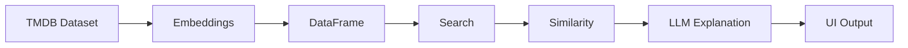

<h1 align="center">🎬 ShowMatcher — AI TV Show Recommender</h1>
<p align="center"><em>Semantic search meets witty AI — discover your next binge with intelligent, story-driven recommendations</em></p>

<p align="center">
  <a href="https://flask.palletsprojects.com/"></a>
  <a href="https://www.sbert.net/"></a>
  <a href="https://groq.com/"></a>
  <a href="https://www.python.org/"></a>
  <a href="https://www.docker.com/"></a>
  <a href="https://huggingface.co/spaces/Aditya8595/TV-Shows-Recommender"></a>
</p>

---

## 🚀 Live Demo — Try It Now

<div align="center">
  <a href="https://huggingface.co/spaces/Aditya8595/TV-Shows-Recommender">
    
  </a>
</div>

<br>

<center>

| 🔍 **Search any show** | 🤖 **AI explains why** | ⭐ **Smart filters** |
|:----------------------:|:----------------------:|:--------------------:|
| Find shows by name with autocomplete | Groq Llama 3.3 generates witty, specific reasons | Filter by votes, rating, seasons, episodes |

</center>


---

## 📍 What Makes This Different

Most recommenders just say *"users who liked X also liked Y"*. This one **understands why**.

| Traditional Recommender | ShowMatcher |
|------------------------|--------------|
| "Fans of Breaking Bad also liked Ozark" | *"Two mild-mannered chemists who swapped beakers for barrels, proving that suburban desperation makes for unforgettable anti-heroes."* |
| Generic collaborative filtering | Semantic content-based similarity |
| Black-box recommendations | Transparent, explainable AI |
| Static results | Dynamic filters |

**The twist:** Every recommendation includes a **sharp, witty explanation** generated by Groq's Llama 3.3 70B.

---

## 🎯 Features

| Feature | Description |
|---------|-------------|
| 🔍 Semantic Search | Autocomplete + poster previews |
| 🧠 AI Explanations | Unique reasoning for each recommendation |
| 🎚️ Smart Filters | Votes, rating, seasons, episodes |
| 📊 Content Similarity | Sentence embeddings |
| 🖼️ TMDB Integration | Live posters |
| 📱 Responsive UI | Works on all devices |
| 🐳 Docker Ready | Production container |

---

## 🏗️ Architecture

```
User → Flask → Search API → Recommendation Engine → HF Deployment
           ↓
   Sentence Transformers
           ↓
     Cosine Similarity
           ↓
     Groq Llama 3.3
```

---

## 🧱 Tech Stack

| Layer | Technology |
|------|------------|
| Backend | Flask |
| Embeddings | Sentence Transformers |
| LLM | Groq Llama 3.3 |
| Similarity | Scikit-learn |
| Frontend | Bootstrap + JS |
| Posters | TMDB API |
| Container | Docker |
| Deployment | Hugging Face Spaces |

---

## 📊 Data Pipeline



---

## 📊 Dataset

- Source: TMDB TV Dataset (2023)
- Size: 150k → 47,520 cleaned
- Embeddings: 384-dim vectors
- Features: name, overview, genres, created_by, vote_count, etc.

---

## 🚀 Run Locally

### Prerequisites
- Python 3.10+
- 8GB RAM
- Groq API Key

### Setup

```bash
git clone https://github.com/Adityajain8595/tv-show-recommender.git
cd tv-show-recommender

python -m venv venv
source venv/bin/activate   # Windows: venv\Scripts\activate

pip install -r requirements.txt

echo "GROQ_API_KEY=your_key" > .env

python run.py
```

Visit: http://localhost:5000

---

## 🐳 Docker

```bash
docker build -t tv-recommender .
docker run -d -p 5000:5000 tv-recommender
```

---

## 🔌 API Endpoints

| Endpoint | Method | Description |
|---------|--------|------------|
| /api/search | GET | Search shows |
| /api/recommend | GET | Get recommendations |
| /api/popular-shows | GET | Top shows |
| /api/stats | GET | Filter stats |

---

## 📦 Example Response

```json
{
  "target_show": {
    "name": "Breaking Bad",
    "vote_average": 8.0
  },
  "recommendations": [
    {
      "name": "Better Call Saul",
      "similarity_score": 0.68,
      "explanation": "Jimmy's descent mirrors Walter White..."
    }
  ]
}
```

---

## 🐳 Dockerfile

```dockerfile
FROM python:3.11-slim

RUN useradd -m -u 1000 user
USER user

WORKDIR /app
COPY --chown=user requirements.txt .
RUN pip install --no-cache-dir --user -r requirements.txt

COPY --chown=user . .
EXPOSE 7860

CMD ["python", "run.py"]
```

---

## 🌐 Deployment

- Hugging Face Spaces (Docker SDK)
- GitHub Repo: https://github.com/Adityajain8595/TV-Shows-Recommendation-System

---

## 🛠️ Environment Variables

| Variable | Required | Description |
|---------|----------|------------|
| GROQ_API_KEY | Yes | LLM API key |

---

## 💡 How It Works

1. Generate embeddings  
2. Compute cosine similarity  
3. Rank top matches  
4. Generate explanation via LLM  

---

## 🤝 Contributing

```bash
git checkout -b feature/new-feature
git commit -m "Add feature"
git push origin feature/new-feature
```

---

## 📧 Contact

**Aditya Jain**

<p>
<a href="https://www.linkedin.com/in/adityajain8595/">LinkedIn</a> |
<a href="https://github.com/Adityajain8595">GitHub</a> |
<a href="https://huggingface.co/Aditya8595">Hugging Face</a>
</p>

---

## 🙏 Acknowledgments

- TMDB Dataset  
- Groq Llama API  
- Hugging Face Spaces  
- Sentence Transformers  